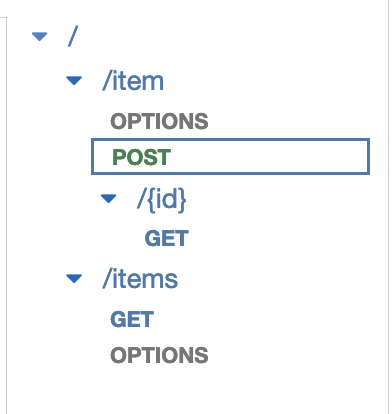
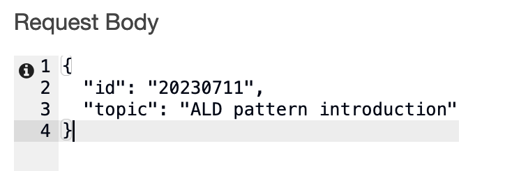
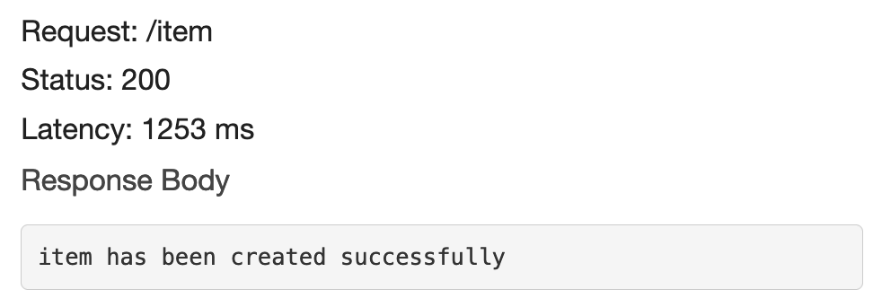
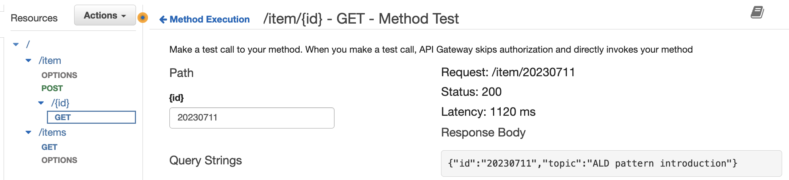

# ALD

## Introduction

ALD is a CDK project template for building Apigateway-Lambda-Dynamodb pattern application.

The template comes with a couple sample APIs to demostrate how to composite components together, e.g Manage Lambda access permission to DynamoDB, Integrate API gateway with Lambda.

- /items

  - GET: get all items

- /item

  - POST: create a new item

- /item/{id}
  - GET: get a specific item

## Usage

Setup a playground to familiarize how things work:

- Create stack

  ```
  npm install
  npx cdk deploy
  ```

- Delete stack

  ```
  npx cdk destroy
  ```

After the stack creation is completed, find the `items` API in API Gateway service in the AWS console.

Let's create an item via the API.

- Click `POST` that is under `/item`, then clickk `Test`.

  

- Copy and paste the following data into `Request Body`.

  ```
  {
    "id": "20230711",
    "topic": "ALD pattern introduction"
  }
  ```

  

- Scroll down to the bottom of the page then click `Test`.

  

- Go to `GET` that is under `/item/{id}`, lets get the item via ID.

  Type `20230711` in Path `{id}`, then scroll down to the bottom of the page and click `Test`

  

If you are a command line lover, find out the `API key` and `Invoke URL` then run the following curl command to test:

```
curl -X POST -d '{ "id": "20230712", "topic": "EKS Blueprints" }' -H "x-api-key: <API_KEY_PLACEHOLDER>" -H "Content-Type: application/json" <INVOKE_URL_HOLDER>/item

item has been created successfully
```

```
curl -X GET -H "x-api-key: <API_KEY_PLACEHOLDER>" -H "Content-Type: application/json" <INVOKE_URL_HOLDER>/items

[{"id":"20230711","topic":"ALD pattern introduction"},{"id":"20230712","topic":"EKS Blueprints"}]
```
